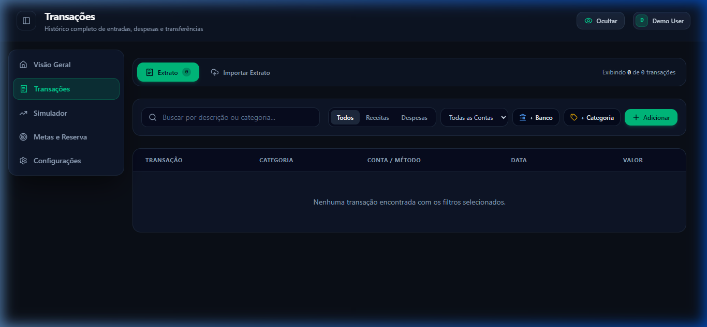

# FinanceHub API 🚀 | Backend RESTful & Engine Financeiro

<p align="center">
  
  
  
  
  
  
  
</p>

---

## 🌐 Deploy em Produção

A API está operando em alta disponibilidade via Serverless Functions da Vercel integrada ao banco PostgreSQL gerenciado no Neon:

* ⚡ **URL Base da API:** [https://finance-api-forja5.vercel.app](https://finance-api-forja5.vercel.app/)
* 🩺 **Health Check:** [https://finance-api-forja5.vercel.app/api/health](https://finance-api-forja5.vercel.app/api/health)
* 🖥️ **Frontend em Produção:** [https://finance-green-six.vercel.app](https://finance-green-six.vercel.app/)
* 🗄️ **Database:** [Neon.tech](https://neon.tech/) (PostgreSQL Serverless - AWS us-east-2)

---

## 🏗️ Arquitetura & Engenharia do Backend

A API foi desenvolvida seguindo princípios de **Clean Code**, **Separação de Responsabilidades (SoC)** e suporte nativo tanto para execução contínua em Node.js tradicional quanto para Serverless Functions em ambientes em nuvem:

```
finance-api/
├── api/
│   └── index.ts            # Entrypoint adaptativo para Vercel Serverless
├── prisma/
│   ├── schema.prisma       # Modelagem dos esquemas PostgreSQL (User, Account, Category, etc.)
│   └── seed.ts             # Populador de categorias padrão e dados de demonstração
├── src/
│   ├── app.ts              # Instância do Fastify, plugins (CORS, JWT, Multipart) e rotas
│   ├── env.ts              # Validação de variáveis de ambiente com esquemas Zod
│   ├── server.ts           # Entrypoint tradicional do servidor HTTP (Porta 3333)
│   ├── lib/
│   │   └── prisma.ts       # Singleton do PrismaClient com connection pooling
│   ├── middlewares/
│   │   ├── auth.ts         # Hook de verificação de token JWT Bearer
│   │   └── error-handler.ts# Tratamento centralizado de erros e exceções HTTP
│   └── routes/
│       ├── auth.routes.ts         # /api/auth (Login, Cadastro, Perfil, Senha)
│       ├── accounts.routes.ts     # /api/accounts (CRUD de Contas Bancárias)
│       ├── categories.routes.ts   # /api/categories (CRUD de Categorias)
│       ├── transactions.routes.ts # /api/transactions (CRUD e recálculo atômico de saldo)
│       ├── goals.routes.ts        # /api/goals (Metas e Reserva de Emergência)
│       ├── analytics.routes.ts    # /api/analytics (Métricas, Fluxo de Caixa, Despesas)
│       └── csv.routes.ts          # /api/csv/parse (Leitura e autoclassificação de extratos)
├── vercel.json             # Regras de build e reescrita de rotas serverless
└── package.json
```

---

## 🗄️ Persistência de Dados: PostgreSQL Neon (Correção Técnica)

> [!IMPORTANT]
> **Esclarecimento de Arquitetura:**
> Diferente de abordagens iniciais que utilizavam arquivos locais SQLite, este backend roda **100% em PostgreSQL na nuvem através do Neon Serverless**. 
> 
> **Por que o PostgreSQL é indispensável na Vercel?**
> A Vercel opera com funções serverless efêmeras em containers de sistema de arquivos *somente leitura* (read-only). Um arquivo de banco local como `dev.db` seria descartado a cada nova invocação.
> 
> Com o **Neon PostgreSQL**:
> 1. Todas as transações financeiras possuem garantia **ACID** e persistência definitiva.
> 2. O acesso ao banco se beneficia de **Connection Pooling nativo**, prevenindo o estouro de conexões mesmo em picos de concorrência.
> 3. Autenticação própria com **JWT + Bcrypt**, eliminando cotas de e-mail e dependências de autenticadores externos.

---

## 📸 Interface Consumindo a API em Tempo Real

Abaixo, algumas das telas do frontend integrado consumindo os endpoints desta API em produção:

| Visão Geral & Balanço Consolidado | Livro-Razão de Transações |
| :---: | :---: |
|  |  |

| Simulador de Juros & Projeções | Metas & Diagnóstico de Reserva |
| :---: | :---: |
|  |  |

---

## 📋 Documentação dos Endpoints da API

### 🔐 Autenticação (`/api/auth`)
| Método | Endpoint | Protegido | Descrição |
| :--- | :--- | :---: | :--- |
| `POST` | `/api/auth/register` | Não | Cadastro de novo usuário com criação de categorias padrão |
| `POST` | `/api/auth/login` | Não | Autentica credenciais e gera Token JWT Bearer (7 dias) |
| `GET` | `/api/auth/me` | Sim | Retorna os dados do perfil do usuário autenticado |
| `PUT` | `/api/auth/profile` | Sim | Atualiza nome, e-mail e avatar |
| `PUT` | `/api/auth/password` | Sim | Altera a senha do usuário com validação da senha anterior |

### 💳 Contas Bancárias (`/api/accounts`)
| Método | Endpoint | Protegido | Descrição |
| :--- | :--- | :---: | :--- |
| `GET` | `/api/accounts` | Sim | Lista todas as contas do usuário (corrente, cartão, investimento) |
| `POST` | `/api/accounts` | Sim | Cria nova conta bancária |
| `PUT` | `/api/accounts/:id` | Sim | Atualiza dados e saldo da conta |
| `DELETE` | `/api/accounts/:id` | Sim | Exclui a conta e transações vinculadas |

### 🏷️ Categorias (`/api/categories`)
| Método | Endpoint | Protegido | Descrição |
| :--- | :--- | :---: | :--- |
| `GET` | `/api/categories` | Sim | Retorna categorias do sistema (globais) e do usuário |
| `POST` | `/api/categories` | Sim | Cria nova categoria personalizada |
| `PUT` | `/api/categories/:id` | Sim | Edita categoria personalizada do usuário |
| `DELETE` | `/api/categories/:id` | Sim | Remove categoria (valida se não há transações associadas) |

### 💸 Transações (`/api/transactions`)
| Método | Endpoint | Protegido | Descrição |
| :--- | :--- | :---: | :--- |
| `GET` | `/api/transactions` | Sim | Lista transações com filtros (`month`, `type`, `accountId`, `categoryId`, `search`) |
| `POST` | `/api/transactions` | Sim | Registra transação e **atualiza atomicamente o saldo da conta** |
| `POST` | `/api/transactions/import` | Sim | Importação em lote de transações conciliadas |
| `PUT` | `/api/transactions/:id` | Sim | Atualiza transação e reverte/recalcula saldo da conta |
| `DELETE` | `/api/transactions/:id` | Sim | Exclui transação e ajusta o saldo proporcional da conta |

### 🎯 Metas & Reserva (`/api/goals`)
| Método | Endpoint | Protegido | Descrição |
| :--- | :--- | :---: | :--- |
| `GET` | `/api/goals` | Sim | Lista objetivos patrimoniais |
| `POST` | `/api/goals` | Sim | Cria nova meta patrimonial com valor-alvo e prazo |
| `PUT` | `/api/goals/:id` | Sim | Atualiza valores poupados e progresso da meta |
| `DELETE` | `/api/goals/:id` | Sim | Remove meta cadastrada |

### 📊 Análises & Métricas (`/api/analytics`)
| Método | Endpoint | Protegido | Descrição |
| :--- | :--- | :---: | :--- |
| `GET` | `/api/analytics/summary` | Sim | Retorna receita, despesa, balanço, taxa de poupança e investimentos do mês |
| `GET` | `/api/analytics/cash-flow` | Sim | Histórico consolidado de fluxo de caixa mês a mês |
| `GET` | `/api/analytics/category-expenses`| Sim | Distribuição de despesas por categoria com percentuais |

### 📑 Conciliação Bancária (`/api/csv`)
| Método | Endpoint | Protegido | Descrição |
| :--- | :--- | :---: | :--- |
| `POST` | `/api/csv/parse` | Não | Upload de extrato CSV bancário com autoclassificação heurística inteligente |

---

## 💻 Instalação & Execução Local

```bash
# 1. Instalar dependências
npm install

# 2. Configurar variáveis de ambiente
cp .env.example .env

# 3. Aplicar esquemas ao banco de dados Neon
npx prisma db push

# 4. Popular banco com categorias padrão e usuário demo
npm run seed

# 5. Iniciar em modo desenvolvimento com hot-reload
npm run dev
```

* Servidor HTTP local: `http://localhost:3333`
* Health check: `http://localhost:3333/api/health`
* Swagger OpenAPI interativo: `http://localhost:3333/docs`

---

## 📄 Licença

Distribuído sob a licença MIT. Consulte `LICENSE` para mais detalhes.

---

<p align="center">
  Desenvolvido por <b>Gabriel Ferreira</b>.
</p>
